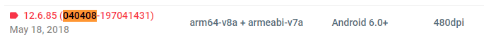

# Welcome to the Pokemon GO Spoofing guide #

[Unrooted Devices](#Unrooted_Devices)

# The guide will need a lot of work and will be updated during my free time #

<h4 id="login-optional-fields">Unrooted Devices</h4>
### Recently Niantic made some changes which require non root users to update their Google Play services Version. So if you're affected by it you'll need to update your Google Play Services version###

The version that will work on your phone is unknown but there's a few versions that you can try and stick with the one that works for you. Those are [12.5.29](https://www.apkmirror.com/apk/google-inc/google-play-services/google-play-services-12-5-29-release/) , [12.6.85](https://www.apkmirror.com/apk/google-inc/google-play-services/google-play-services-12-6-85-release/), [12.6.87](https://www.apkmirror.com/apk/google-inc/google-play-services/google-play-services-12-6-87-release/) and [12.6.88](https://www.apkmirror.com/apk/google-inc/google-play-services/google-play-services-12-6-88-release/) .

### How to know the right version for your phone ###

The easiest way is to go to Settings -> Apps -> All Apps -> Google Play Services which will bring you to this screen:

In this example we can see my current Google Play Services Version: **16.0.89**. Followed by **(040408-...)** 

Those **040408** numbers are the ones we want to find out the version for our phone. Obviously your phone can/will have different ones but reffer to this as an example.

So let's pretend we want to download the version **12.6.85** (linked above) for my phone. We can see there's many **Variants** on apkmirror.com _What a mess!_ You just go on your browser and press **CTRL-F** (⌘ Cmd+F if you're on mac) and type the _magic numbers_ **040408** in my case it found this result:

Then proceed to download and install it accordingly.
