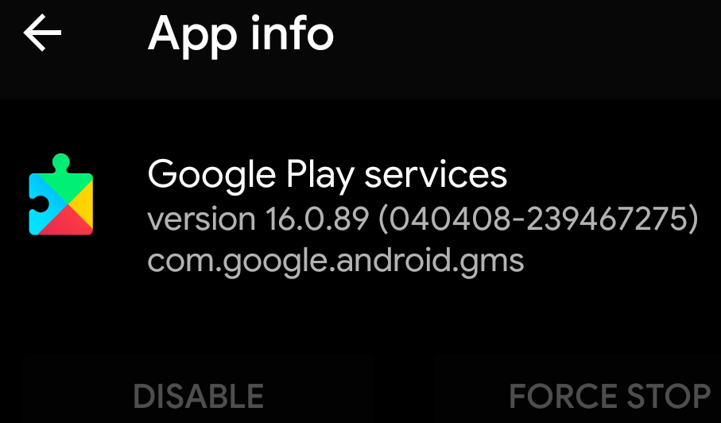
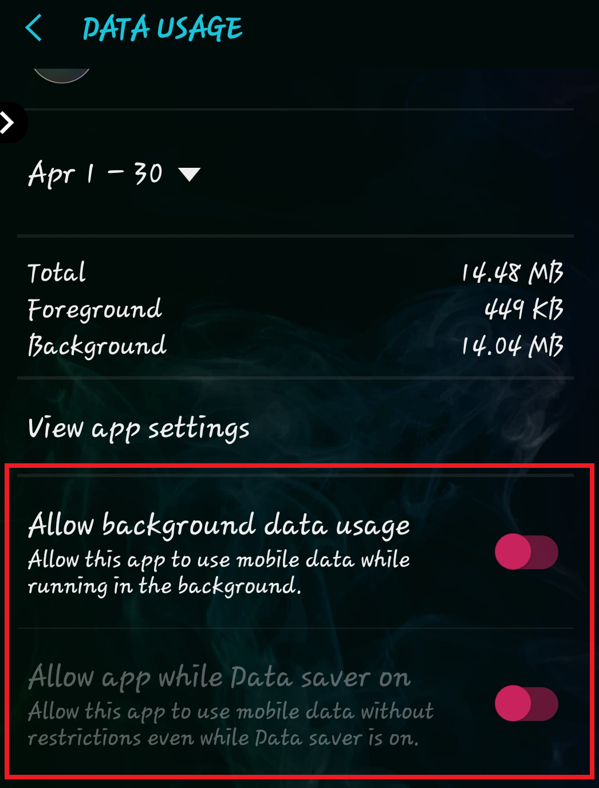
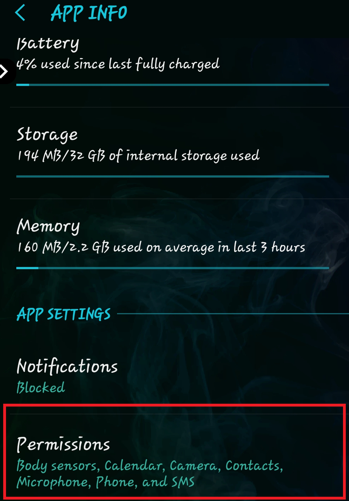
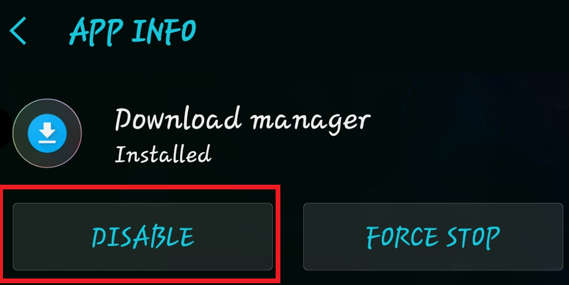
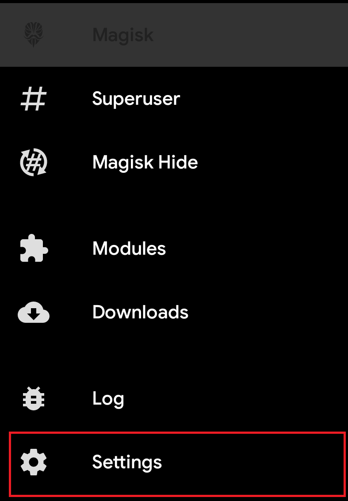

<html>
  <head>
    <!-- CSS -->
    <link rel="stylesheet" type="text/css" href="css/scrollUpButton.css" media="all" />
    <link rel="stylesheet" href="https://maxcdn.bootstrapcdn.com/bootstrap/3.3.7/css/bootstrap.min.css">
    <!-- Javascript -->
    
    
    
  </head>
<body>
<h1> Welcome to the Pokemon GO Spoofing guide </h1>

* [Unrooted Devices](#Unrooted_Devices)
   * [How to Downgrade Google Play Services](#Downgrade_GP_Services)
   * [How to STOP Google Play Updates](#Stop_GP_Services_Updates)
* [Rooted Devices](#Rooted_Devices)
   * [How to hide root](#How_to_hide_root)

<h1 id="Unrooted_Devices">Unrooted Devices</h1>
<h2 id="Downgrade_GP_Services">How to downgrade Google Play Services</h2>
<h3>Recently Niantic made some changes which require non root users to update their Google Play services Version. So if you're affected by it you'll need to update your Google Play Services version</h3>

The version that will work on your phone is unknown but there's a few versions that you can try and stick with the one that works for you. Those are <a href="https://www.apkmirror.com/apk/google-inc/google-play-services/google-play-services-12-5-29-release" target="_blank">12.5.29</a>, <a href="https://www.apkmirror.com/apk/google-inc/google-play-services/google-play-services-12-6-85-release" target="_blank">12.6.85</a>, <a href="https://www.apkmirror.com/apk/google-inc/google-play-services/google-play-services-12-6-87-release" target="_blank">12.6.87</a> and <a href="https://www.apkmirror.com/apk/google-inc/google-play-services/google-play-services-12-6-88-release" target="_blank">12.6.88</a> . Before you downgrade do the following go to <b>Settings -> Device Administrator -> uncheck "Find My Device"</b>. Afterwards proceed to install any version mentioned above and <b>reboot your phone</b> then check if you're able to spoof.

<h3> How to know the right version for your phone </h3>

The easiest way is to go to Settings -> Apps -> All Apps -> Google Play Services which will bring you to this screen:

In this example we can see my current Google Play Services Version:<b>16.0.89</b>. Followed by <b>(040408-...)</b> 

Those <b>040408</b> numbers are the ones we want to find out the version for our phone. Obviously your phone can/will have different ones but reffer to this as an example. Sometimes certain phones only show <b>448</b> for example so you put a 0 before each number making it <b>040408</b>

So let's pretend we want to download the version <b>12.6.85</b> (linked above) for my phone. We can see there's many <b>Variants</b> on <href="http://apkmirror.com">apkmirror.com</a> <i>What a mess!</i> You just go on your browser and press <b>CTRL-F</b> (⌘ Cmd+F if you're on mac) and type the <i>magic numbers</i> <b>040408</b> in my case it found this result:

Then proceed to download and install it accordingly.
<h2 id="Stop_GP_Services_Updates">How to Stop Google Play Updates</h2>

This is a necessary step for non-root users so you don't have to downgrade all the time because Google Play Services updates itself on the background. So let's start off by Disabling mobile background data for Google Play Services:

1. Start by going to your phone's Settings
2. Click on "Apps"  

3. Click on "Google Play Services  

4. Click on <b>Mobile Data</b> Note: In some phones it's called <b>Data Usage</b>

5. Disable any background data permissions the app has. (Some devices will have different names for the option. Just untoggle all the Data permissions)

6. If you need to downgrade your Google Play Services do it now. Reffer to <a href="#how-to-downgrade-google-play-services">How to Downgrade Google Play Services</a> Next we want to Disable Google Play Services storage permissions. (Reffer to the picture on the Step 4) and Click on <b>Permissions</b>

7. Then untoggle <b>Storage</b>

8. Go back to the Google Play Services app info menu and tap <b>Storage</b>

9. Press the <b>Clear Cache</b> button

10. Go back to your <b>Settings -> Apps -> All Apps</b> click the <b>Google Play Store</b> (not the services) and press the <b>Disable</b> button

11. Go back to <b>Settings -> Apps</b> and click on the 3 vertical dots <b>⋮</b> and select Show System apps

12. On that same screen click on the app <b>Download Manager</b> and click Disable

13. Restart your phone. That's it! Google Play Services shouldn't update anymore. Credits to @MichelleO 盧金虹#7754

<h1 id="Rooted_Devices">Rooted Devices</h1>

<h2 id="How_to_hide_root">How to properly hide root from Pokemon GO</h2>

Hiding root from Pokemon GO is fairly simple. Start by opening the Magisk Manager app and click on the highlighted button (picture below) 

Then select Settings (picture below) 

Then press "Hide Magisk Manager"(4th option) (picture below)

Magisk should close in order to change the package name. You can check if it was sucessful by repeating the same steps and checking if now instead of <b>Hide Magisk Manager</b> it says <b>Restore Magisk Manager</b>. This means you're good to go to the next step . If it doesn't you'll have to repeat this step again. Otherwise continue on.

Now click the top left corner button like you did on the first step since we started (first picture) and select <b>Magisk Hide</b>

There you will find a list of your installed apps. Put a  on Pokemon GO 

That's it! Pokemon GO shouldn't detect root anymore. Open it and test. If you do happen to get invalid OS error then check in your internal storage and delete any folder(s) with the name <b>"Magisk"</b>, <b>"Magisk Manager"</b> and retry to open Pokemon GO

<a href="#" class="scrollUpButton"></a>
</body>
</html>
